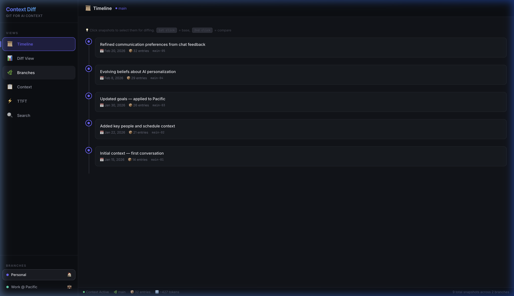
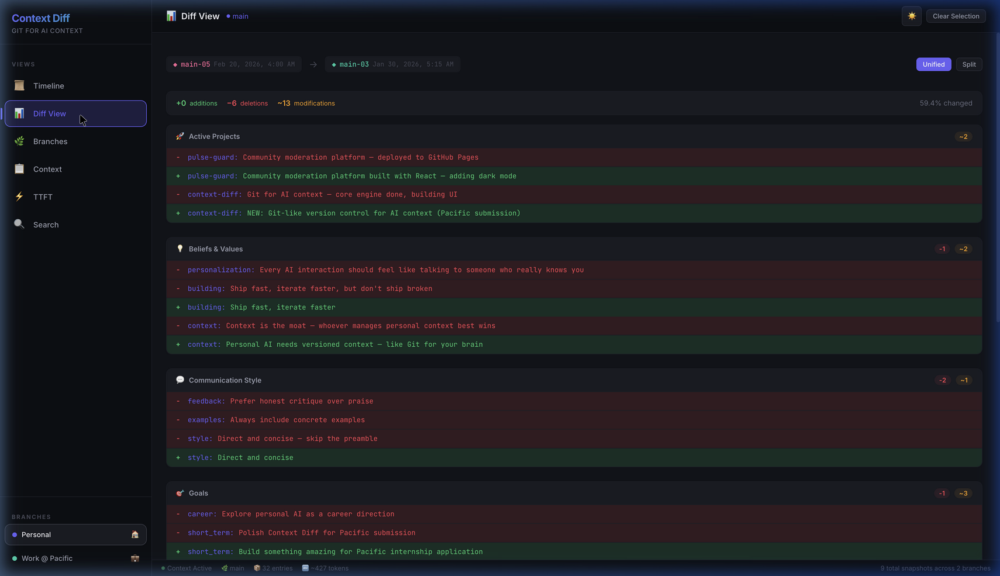
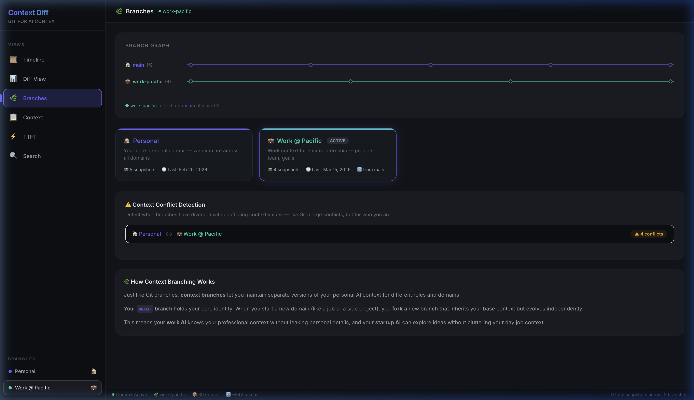
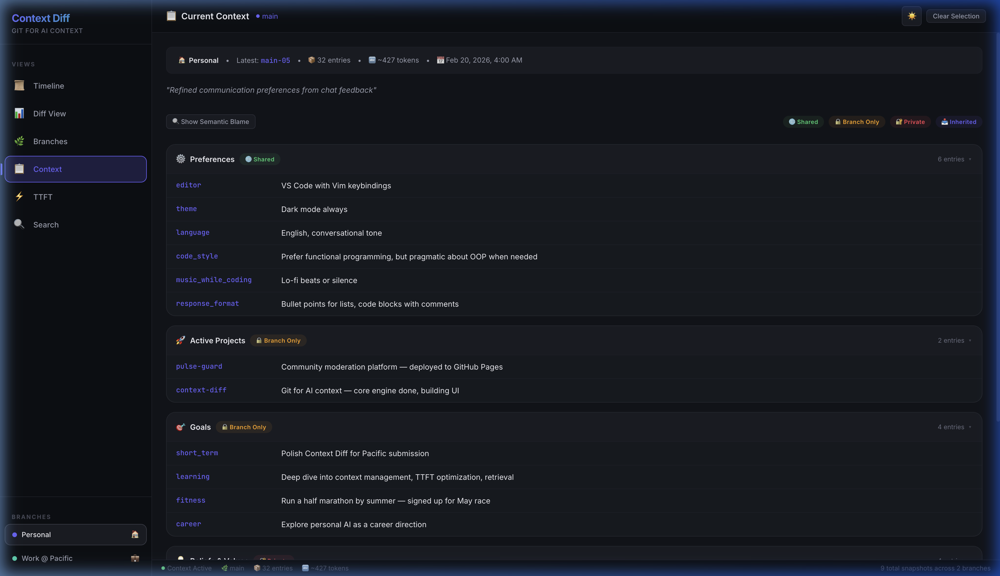
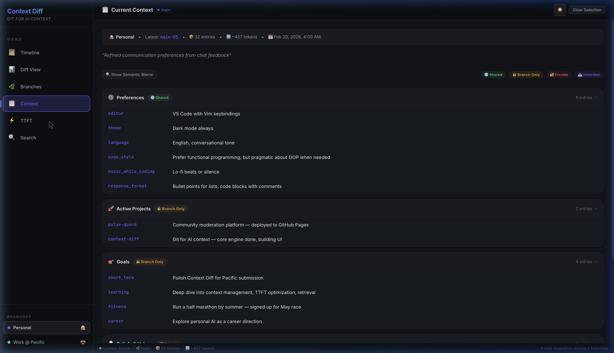
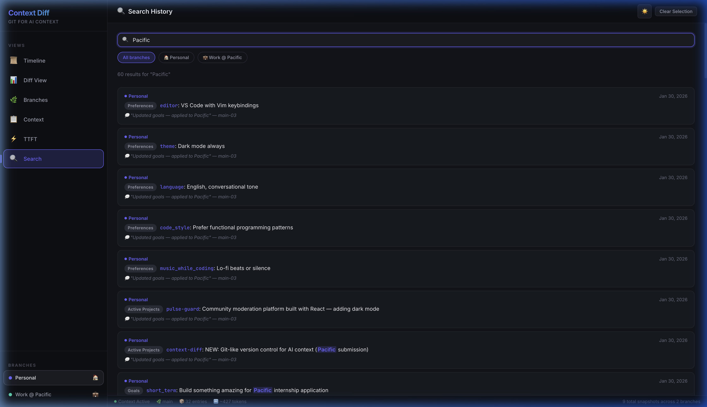
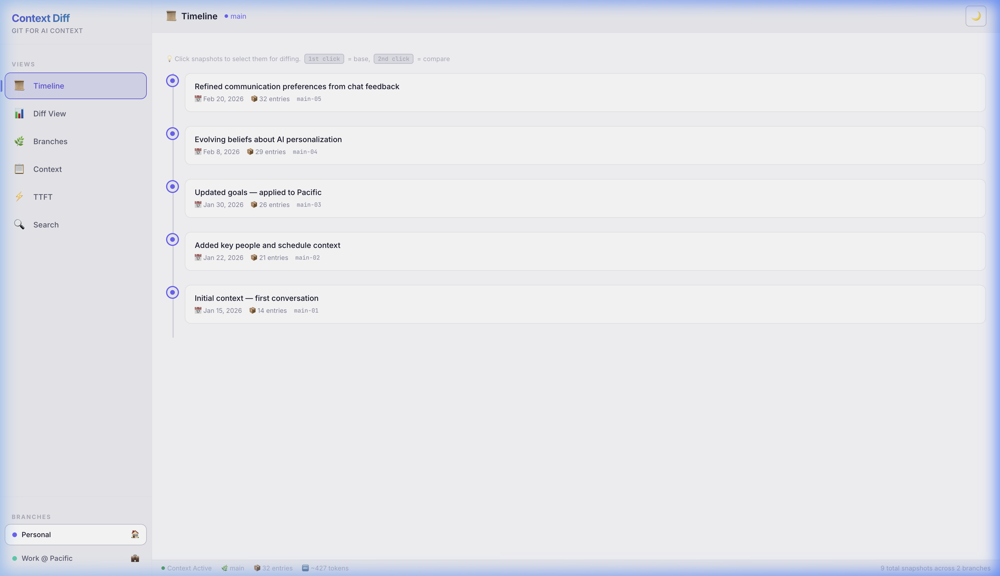

<div align="center">

# 🔀 Context Diff

**Version control for your personal AI context.**


</div>

---

**Candidate:** Neha Suram  
**Email:** nehasuram04@gmail.com  
**Time Spent:** ~5 hours  

---

## 🤔 The Problem

Every AI conversation starts from scratch. You tell it your preferences, your projects, your goals — and next session, it's all gone. This wastes time, wastes tokens, and kills the "personal" in personal AI.

**Context Diff** fixes this by treating your AI context like source code. You version it, branch it, diff it, and search it — just like Git, but for who you are.

---

## 🚀 Quick Start

```bash
git clone https://github.com/Nehareddy0404/context-diff.git
cd context-diff
npm install
npm run dev
```

Open [http://localhost:5173](http://localhost:5173)

Run tests: `npm test` (28 tests, all passing)

---

## 📸 Screenshots

### Timeline — Your Context History
A commit-log style view of every context snapshot. Click any two snapshots to compare them, just like selecting commits in Git.



### Diff Engine — See What Changed
Color-coded unified diff showing additions (green), deletions (red), and modifications (orange) between any two snapshots. Grouped by context category for clarity.



### Branch Manager — Context Isolation
Visual branch graph showing how your context forks. Your personal `main` branch and your `work-pacific` branch evolve independently — like Git branches for different parts of your life.

The **Context Conflict Detection** panel automatically finds contradictions between branches (e.g., work says "professional tone" but personal says "casual"). These are flagged before any merge.



### Context Editor — Semantic Blame + Permissions
Browse your current context entries with **Semantic Blame** — every entry shows when it was introduced, who/what changed it, and why, just like `git blame`.

Each category also has a **Permission Level**: Shared, Branch-Only, Private, or Inherited. This controls what context leaks across branches — your therapy notes shouldn't reach your work AI.



### TTFT Dashboard — Measuring the Impact
Quantifies how pre-loaded context reduces Time to First Token. With branched + cached context, TTFT drops from 2.8s to 0.38s — an **87% reduction**. The AI already knows you, so it skips the "getting to know you" phase.



### Search — Find Anything Across History
Full-text search across all branches and snapshots. Answers questions like "When did I first mention Pacific?" or "When did my goals change?"



### 🌗 Light & Dark Themes
Toggle between premium dark and clean light themes with one click.



---

## 🧠 Three Novel Features

These go beyond a basic CRUD app and show deeper thinking about how context management should work:

### 1. Semantic Blame
like `git blame`, but for your AI context. Every entry is traceable — you can see when it was added, what conversation triggered the change, and who authored it (system, user, or conversation). This is critical for AI agents that need to reason about *why* context exists, not just *what* it says.

### 2. Context Conflict Detection
When branches diverge, values can contradict. Your work branch might say your communication style is "professional and async-first," while your personal branch says "casual and direct." Context Diff automatically detects these conflicts and surfaces them with severity ratings — essential before any cross-branch retrieval or merge.

### 3. Permission Levels
Not all context should be visible everywhere. Categories are tagged as:
- **Shared** — available across all branches (e.g., your name)
- **Branch-Only** — stays in the branch that owns it (e.g., work projects)
- **Private** — never exposed to other branches (e.g., personal beliefs)
- **Inherited** — pulled from the parent branch on fork

This prevents context leakage — your work AI doesn't see your personal goals, and your personal AI doesn't see your work standup notes.

---

## 🏗️ Architecture

```
src/
├── App.jsx              # Layout shell + state management (260 lines)
├── components/
│   ├── Timeline.jsx     # Snapshot history with selection
│   ├── DiffView.jsx     # Unified diff comparison
│   ├── BranchManager.jsx # Branch graph + conflict detection
│   ├── ContextEditor.jsx # Context browser + blame + permissions
│   ├── TTFTDashboard.jsx # TTFT performance visualization
│   └── SearchPanel.jsx  # Full-text search
├── data/
│   └── sampleData.js    # 9 snapshots, 2 branches, 8 categories
├── utils/
│   └── diffEngine.js    # Core algorithms (diff, blame, conflicts, TTFT)
│   └── diffEngine.test.js # 28 unit tests
└── index.css            # Design system (~1900 lines)
```

**Key decisions:**
- **Pure functions** — all computation lives in `diffEngine.js`, making it testable and reusable
- **No backend** — runs entirely client-side with synthetic data that simulates 2 months of real context evolution
- **CSS custom properties** — the entire theme system uses CSS variables, making the light/dark toggle a single attribute swap
- **Synthetic but realistic data** — 9 snapshots tell a story of applying to Pacific, learning new tools, and evolving as a developer

---

## 🧪 Testing

```bash
npm test
```

28 tests covering:
- Diff computation (additions, deletions, modifications, unchanged)
- Stats calculation
- Search across branches and snapshots
- Context size estimation
- Token estimation
- TTFT computation
- Semantic blame tracing
- Conflict detection between branches
- Permission level assignment

---

## 📚 More Details

See [DOCUMENTATION.md](DOCUMENTATION.md) for:
- Detailed architecture diagrams
- Design decisions and tradeoffs
- CSS design system documentation
- The "Git for AI Context" metaphor explained

---

<div align="center">
<em>Built for Pacific — because the future of personal AI is context management.</em>
</div>
